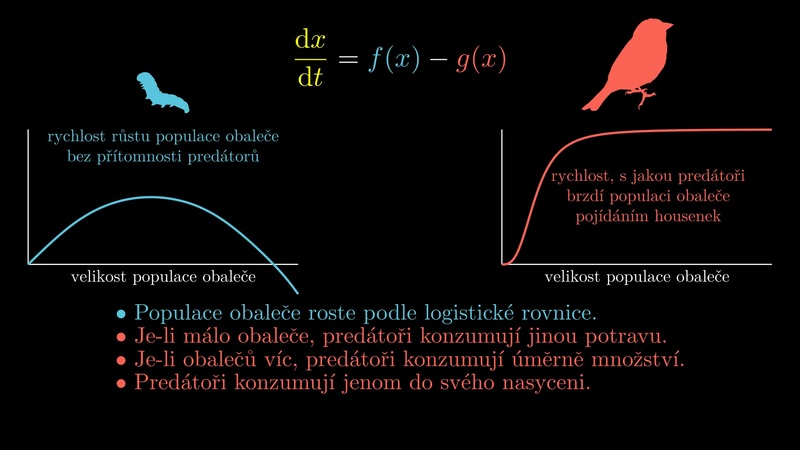

{::options parse_block_html="true" /}

Příroda je krásná a matematika dokáže odhalit její tajemství. Žádná věda není tak skvělá v odhalování tajemství jako matematika. 😀

Učím matematiku na LDF MENDELU v Brně. Myslím si, že matematika pomáhá studentům lépe proniknout do oblasti jejich odborných zájmů, ať se jedná o dřevařství, krajinářství, arboristiku či cokoliv jiného. Jsem hrdý na to, že můžu studentům, budoucím odborníkům na dřevo, na stromy či na krajinu, pomoct získat aspoň základní přehled, jaké nástroje se dají využít k tomu, abychom složitému světu okolo sebe rozuměli co nejlépe.

Pokud studujete na LDF asi se zajímáte o ty nejhezčí objekty: stromy, dřevo, lesy, krajinu. To jsou i objekty nejhůře uchopitelné kvantitativními metodami. Vskutku, dřevo je silně anizotropní a nelineární materiál a do stromu nebo pod zem nevidíme. Proto jsou matematické metody v těchto oborech opravdovou výzvou, proto jsou úlohy mnohem těžší než běžné fyzikální úlohy a proto bychom se měli soustředit zejména na teorii a souvislosti než na konkrétní příklady.

Takový analytický výpočet nosníku, užitečný pro strojaře nebo stavaře, je málo zajímavý pro dřevaře. Dřevař pracuje s přírodním materiálem, který má v různých směrech různé vlastnosti a chová se jinak v tahu a tlaku a nemůžeme si jej namíchat podle potřeby, jako ocel nebo beton. Proto se musíme zaměřit na obecné využití nástrojů pro výpočty. Konkrétní realistické a prakticky zajímavé výpočty bývají tak složité, že je svěřujeme počítačům. Musíme však umět data pro počítačovou simulaci připravit a posoudit, zda předpřipravený model je vhodný pro naše zamýšlené využití. Jinými slovy: dost často stačí vědět, co je potřeba počítat a co se dá spočítat z jakých dat. Reálný výpočet udělá někdo jiný. Mějte toto během studia na paměti.

## Rozcestník

* [Matematika](/pages/mt) pro první ročníky bakalářského studia. Základy vysokoškolské matematiky.
* [Aplikovaná matematika](/pages/am) a Inženýrská matematika pro první ročníky magisterského studia. Navazuje na předchozí matematiku.
* [Dynamické modely populací](/pages/dmp). Poprvé se učí od jara 2023. 
* [Věda, výzkum](/pages/research). Publikace, konference, vědecké počiny.

## Zamyšlení

> #### Neučte se matematiku bez souvislostí 
>
>[V. I. Arnold v zamyšlení O výuce matematiky](https://www.math.fsu.edu/~wxm/Arnold.htm)
>
  * Matematika je součástí fyziky. Fyzika je experimentální věda, část přírodních věd. Matematika je součást fyziky s levnými experimenty.
  * V polovině 20. století proběhl pokus oddělit matematiku a fyziku. Následky se ukázaly jako katastrofické. Celé generace matematiků vyrostly bez ovládnutí poloviny své vědy a s úplnou  ignorací věd ostatních. Začaly studenty učit svoji strašnou scholastickou pseudomatematiku...
  * Složité modely jsou málokdy užitečné (kromě psaní vlastní disertace).
  * Učitel matematiky, který se neseznámil alespoň s některými částmi kurzu od Landaua a Lifšice (slavný kurz teoretické fyziky, pozn. překl.), se stane reliktem stejně jako ten, kdo nezná rozdíl mezi otevřenou a uzavřenou množinou.
{: .block-tip }

