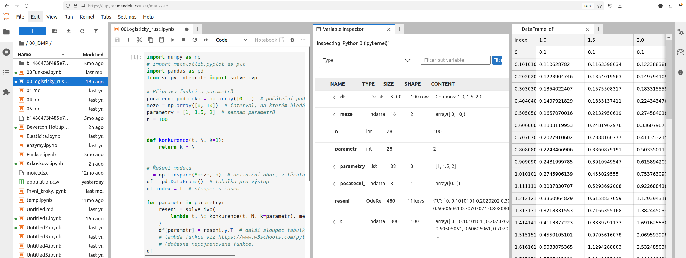

## User

### Instalace balíčků

Pokud nějaký balík chybí, ideálně napsat adminovi. Je možné nainstalovat i do
svého profilu. 

```
!pip install <balik>
```

(S vykřičníkem Jupyter bere příkaz jako shell příkaz, ne jako Python příkaz.
Stačí spustit jednou, balík bude nainstalovaný trvale.)

### Variable Inspector

Variable Inspector si musí bohužel asi každý zájemce nainstalovat sám. 

```
!pip install lckr_jupyterlab_variableinspector
```



### Kontrola syntaxe

Na serveru je nainstalován [balík](https://github.com/jupyter-lsp/jupyterlab-lsp) `jupyterlab-lsp`, který kontroluje syntaxi Pythonu.


Pokud některé kontroly syntaxe nechcete, je možné je vypnout. V souboru
`~/.config/pycodestyle` uveďte, které kontroly chcete vypnout. Například takto:

```
[pycodestyle]
ignore = E303
max-line-length = 120
```

Nastavení ignoruje [chybu E303](https://www.flake8rules.com/rules/E303.html) a povolí maximální délku řádku 120 znaků.


## Admin

### Instalace

```
sudo apt install python3 python3-dev git curl mlocate
curl -L https://tljh.jupyter.org/bootstrap.py | sudo -E python3 - --admin admin
sudo updatedb
```

### Po instalaci

Nalogovat se jako admin, spustit terminal a nainstalovat knihovny.

```
sudo -E pip install matplotlib pandas numpy scipy jupytext sphinx-proof myst-parser scikit-learn xarary, bokeh, plotly, ipywidgets, solara, polars, seaborn 
```

Nainstalovat rozšíření pro JupyterLab.

```
sudo -E pip install lckr_jupyterlab_variableinspector jupyterlab-lsp
sudo -E pip install 'python-lsp-server[all]'
```

Pomocí `tljh-config` nastavit služby. Například takto (výstup `tlhj-config show`):

```
users:
  admin:
  - admin
https:
  enabled: true
  letsencrypt:
    email: marik@mendelu.cz
    domains:
    - jupyter.mendelu.cz
services:
  cull:
    max_age: 48000
    every: 300
    timeout: 24000
auth:
  type: nativeauthenticator.NativeAuthenticator
  NativeAuthenticator:
    allow_all: true
```

Data o uživatelích se ukládají do `/opt/tljh/state/jupyterhub.sqlite`.

Pokud nechci povolit vytváření uživatelských účtů, tak je potřeba následovně
```
sudo tljh-config set auth.NativeAuthenticator.enable_signup false
sudo tljh-config show
sudo tljh-config reload
```

#### Neaktuální

```
sudo -E pip install jupyter_contrib_nbextensions
sudo -E jupyter contrib nbextension install --sys-prefix
sudo -E jupyter nbextension enable scratchpad/main --sys-prefix
sudo -E jupyter nbextension enable varInspector/main --sys-prefix
sudo -E jupyter nbextension enable snippets/main --sys-prefix
sudo -E jupyter nbextension enable hide_header/main --sys-prefix
sudo -E jupyter nbextension enable hinterland/hinterland --sys-prefix
sudo -E jupyter nbextension enable livemdpreview/livemdpreview --sys-prefix
sudo -E jupyter nbextension enable execute_time/ExecuteTime --sys-prefix
```

Soubor 
```
/opt/tljh/user/etc/jupyter/nbconfig/notebook.json
```
zmenit na 
```
{
  "load_extensions": {
    "contrib_nbextensions_help_item/main": true,
    "scratchpad/main": true,
    "varInspector/main": true,
    "snippets/main": true,
    "hide_header/main": true,
    "hinterland/hinterland": true,
    "livemdpreview/livemdpreview": true,
    "execute_time/ExecuteTime": true
  },  
  "livemdpreview": {
    "show_side_by_side": true
  }
}
```
tj. pridat sekci s show_side_by_side.

### Nastaveni limitu pro uzivatele

V prikazovem radku pres ssh

```
sudo tljh-config set limits.memory 500M
sudo tljh-config set limits.cpu 0.5
sudo tljh-config show
sudo tljh-config reload
```

### Admin pristup k zapisnikum uzivatelu


V prikazovem radku pres ssh (mozna bude potreba opravit verzi Pytohnu)
```
sudo joe /opt/tljh/hub/lib/python3.10/site-packages/tljh/jupyterhub_config.py
```
pripsat
```
c.JupyterHub.admin_access = True
```
ulozit a spustit
```
sudo tljh-config reload
```

### Restart 

[viz zde](https://tljh.jupyter.org/en/latest/troubleshooting/restart.html)

```
sudo tljh-config reload proxy
sudo tljh-config reload hub
```

### Zastavení serveru

```
sudo systemctl stop jupyterhub.service
sudo systemctl stop traefik.service
```

Keep in mind that other services that may also require stopping:

* The user’s Jupyter server: jupyter-username.service
* Traefik.service

### Start

```
sudo systemctl daemon-reload
sudo systemctl start jupyterhub.service
sudo systemctl start traefik.service
```


### Troubleshooting

[viz zde](https://tljh.jupyter.org/en/latest/troubleshooting/providers/custom.html)

```
sudo journalctl -u jupyterhub
sudo journalctl -u traefik
sudo journalctl -u jupyter-<name-of-user>
```

Volba `-f` pro update pri zapsani dalsiho radku v logu

```
sudo journalctl -u jupyterhub -f
```

### Sdileni

Nově vytvoření useři budou mít čtecí přístup do podadresáře my_shared_data_folder

```
sudo mkdir -p /srv/data/my_shared_data_folder
cd /etc/skel
sudo ln -s /srv/data/my_shared_data_folder my_shared_data_folder
```

### Autentizace pomoci native authenticator (old)

Otevrit konfiguracni soubor
```
sudo joe /opt/tljh/hub/lib/python3.10/site-packages/tljh/jupyterhub_config.py
```

Pridat na konec
```
c.JupyterHub.authenticator_class = 'nativeauthenticator.NativeAuthenticator'

import os, nativeauthenticator
####c.JupyterHub.template_paths = [f"{os.path.dirname(nativeauthenticator.__file__)}/templates/"]

if not isinstance(c.JupyterHub.template_paths, list):
    c.JupyterHub.template_paths = []
c.JupyterHub.template_paths.append(
    f"{os.path.dirname(nativeauthenticator.__file__)}/templates/")


c.Authenticator.admin_users = {'admin'}
c.NativeAuthenticator.check_common_password = True
c.NativeAuthenticator.minimum_password_length = 10
c.NativeAuthenticator.allowed_failed_logins = 3
c.NativeAuthenticator.seconds_before_next_try = 1200
c.NativeAuthenticator.enable_signup = False
```

a potom pochopitelne
```
sudo tljh-config show
sudo tljh-config reload
```

#### Hlasky a zpravy

Otevrit konfiguracni soubor
```
sudo joe /opt/tljh/hub/lib/python3.10/site-packages/tljh/jupyterhub_config.py
```
a pridat neco jako 
```
c.JupyterHub.template_vars = {'announcement_login': 'Server je určen jako podpora výuky předmětu Dynamické modely populací na LDF MENDELU v Brně. Přístup mají studenti daného předmětu.'}
```
a potom pochopitelne
```
sudo tljh-config reload
```

#### Proměnné prostředí

Zapsat do souboru `/opt/tljh/config/jupyterhub_config.d/environment.py`. Například takto.

```
c.Spawner.environment = {
        'PREFIX_DYNATREE': '/babice/Mereni_Babice_zpracovani/skripty/',
        'DYNATREE_DATAPATH': '/babice/Mereni_Babice_zpracovani/data/',
        'SOLARA_ASSETS_PROXY': 'false'
}
```

#### Odkazy

* <https://lukas-snoek.com/NI-edu/misc/for_educators.html>


